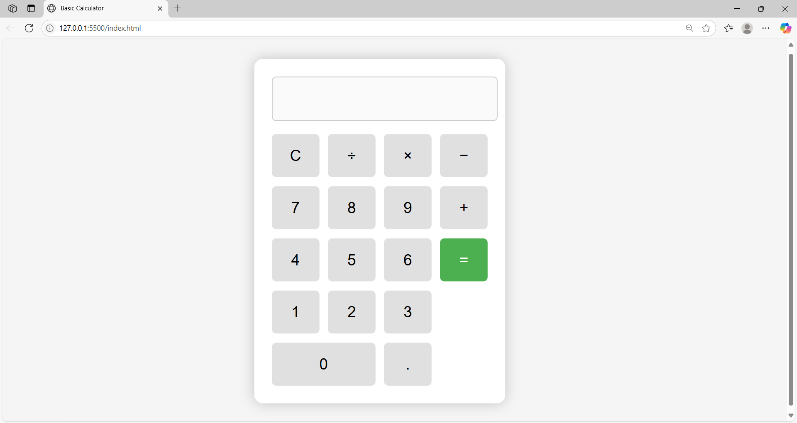

# Basic Calculator

## 📌 Description
This is a simple web-based calculator built using **HTML**, **CSS**, and **JavaScript**.  
It performs basic arithmetic operations and includes keyboard input support and error handling.

---

## 🖥️ Features
- Addition, Subtraction, Multiplication, Division
- Keyboard input support (numbers, operators, Enter, Backspace, 'C')
- User-friendly and responsive UI
- Handles invalid inputs and division by zero

---

## 📁 Project Files
- `index.html` – Calculator structure
- `style.css` – Styling and layout
- `script.js` – JavaScript logic
- `README.md` – This documentation file

---

## ✅ How to Run
1. Open `index.html` in a browser (double-click or use Live Server).
2. Use your mouse or keyboard to enter expressions.
3. Press:
   - `Enter` = calculate
   - `Backspace` = delete
   - `C` = clear

---

## 🧠 Author
Rajat Saini  

---

## 📸 Screenshot

